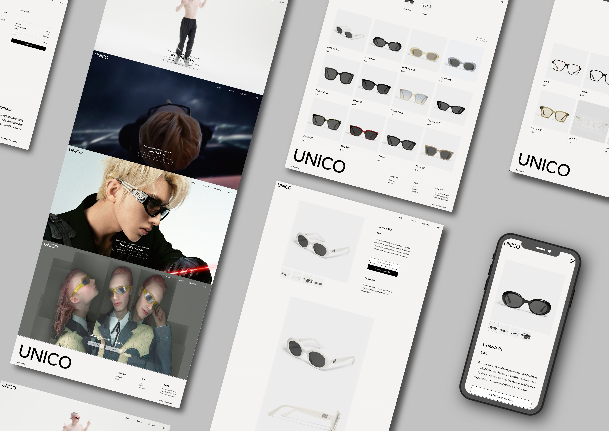

# Online Eyewear Store 'UNICO'

• [Visit the website here](http://ec2-3-73-1-218.eu-central-1.compute.amazonaws.com:3001/)

•	Admin Account : admin123    
•	Admin Password : admin123123!  
   
## Introduction
I have created a virtual brand named 'UNICO' specializing in selling sunglasses and eyeglasses.

I created a responsive website with a backend server for smooth communication between clients and data.

Additionally, I implemented efficient data processing and retrieval in dynamic web applications using MySQL.

   
## Development Environment
•	Client : HTML, React, Styled-components, Redux

•	Server : Node.js, Express

•	Database : MySQL

•	Version and issue management : Github

•	Deployment environment : Amazon web services(AWS)

•	Design : Adobe Illustrator, Adobe Photoshop

   
## Project structure  

 
